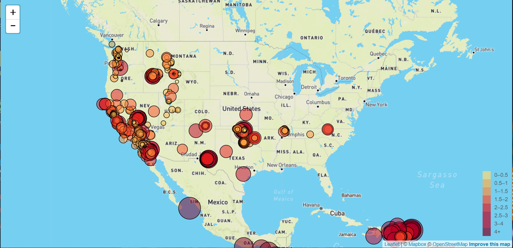

Utilized Javascript, HTML, and Leaflet in order to map all earthquakes recorded by the US Geological survery around the world within the last 7 days. The markers were made to reflect the size of each earthquake. 

